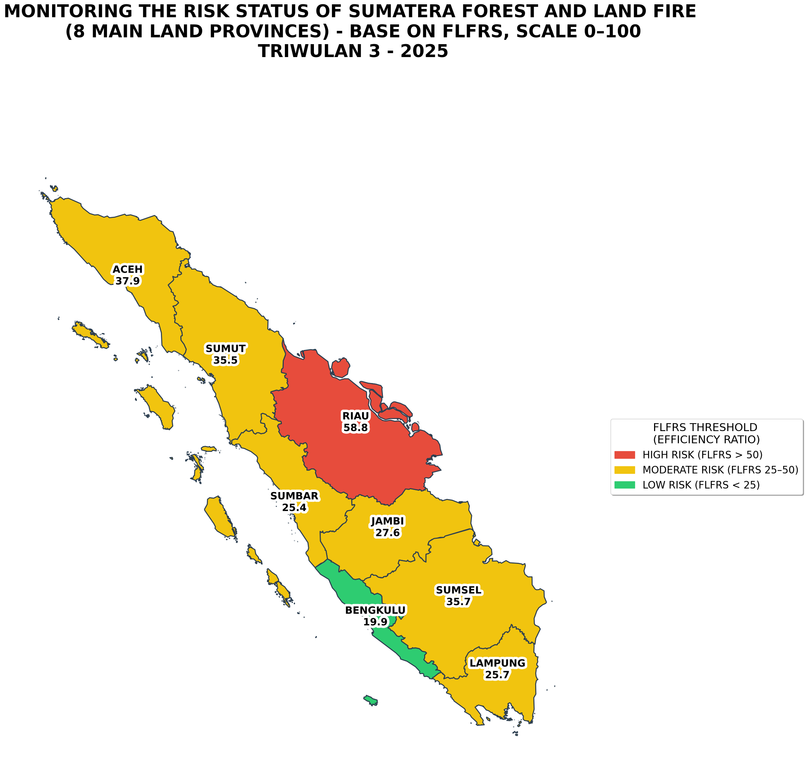

# Spatio-Temporal Forest and Land Fire Risk Modeling in Sumatra

Official implementation of the **VLIF-Model** (Vapor Pressure Demand - Land Vulnerability Integrated Fuzzy Model), as presented in the research: *"Spatio-Temporal Forest and Land Fire Risk Modeling in Sumatra Using Atmospheric-Edaphic Integration via Univariate Fuzzy C-Means"*.

## 📌 Overview
The VLIF-Model integrates atmospheric water demand (VPD) and edaphic vulnerability (LVI/IBK) into a single physical index called **FLFI** (Forest and Land Fire Index). This model objectively zones fire risks using **Univariate Fuzzy C-Means (U-FCM)** and provides a regional risk metric called **FLFRS** (FLF Risk Score).

This repository is updated to reflect the analysis for **Quarter 3 (Q3) 2025**.

## 🚀 Performance Metrics (Q3 2025 Validation)
Based on validation using ground truth hotspot data from Sumatra (July–September 2025):

| Metric | Value | Interpretation |
| :--- | :--- | :--- |
| **FPC** (Fuzzy Partition Coefficient) | **0.7850** | Indicates high cluster separation quality. |
| **Cohen's d** (Predictive Power) | **6.0467** | Very large effect size between high and low-risk zones. |
| **Monthly Aggregated $R^2$** | **0.9999** | Excellent correlation between `FLFI` and hotspot frequency. |

### Efficiency Ratio (ER) Report
The model demonstrates high effectiveness in identifying fire hotspots across different risk levels, particularly in the High-Risk zone.

| Cluster Level | Hotspots | Area Size | **ER (Efficiency Ratio)** |
| :--- | :--- | :--- | :--- |
| Low Risk | 1110 | 22742 | **0.2451** |
| Moderate Risk | 4287 | 19990 | **1.0771** |
| High Risk | 4953 | 9248 | **2.6898** |

> **Note on ER:** The Efficiency Ratio displayed above is the **Global (Regional) ER for Sumatra Island during Q3 2025**. If the temporal scope is expanded (e.g., to an annual model), it is highly recommended to recalculate the ER based on annual temporal data.

## 📁 Repository Structure
* `main.py`: Core logic for FLFI calculation, U-FCM clustering, and validation metrics calculation (ER, Cohen's d, $R^2$).
* `visualization.py`: Script for regional risk extraction (FLFRS), data merger with geospatial boundaries, and generating the final risk map.
* `DATASET_GITHUB_SUMATRA_Q3_2025.csv`: Compiled spatio-temporal dataset (VPD, IBK, Hotspots).
* `gabungan_10_wilayah_batas_provinsi.geojson`: Sumatra administrative boundaries for mapping.

## 🗺️ Visualization Result (Q3 2025)


## 📜 Methodology
1.  **Data Preprocessing**: Loading dataset and filtering for 8 main provinces in Sumatra.
2.  **Clustering (U-FCM)**: Re-running Fuzzy C-Means in-memory to classify grid data into Aman (Low), Waspada (Moderate), and Awas (High) based on FLFI values.
3.  **Local Risk Calculation**: Calculating the FLF Risk Score (FLFRS) for each province based on the local Efficiency Ratio of Q3.
4.  **Geospatial Mapping**: Merging statistics with boundary files and generating a standardized map layout.

## 🛠️ Installation
```bash
pip install -r requirements.txt
python main.py
python visualization.py

