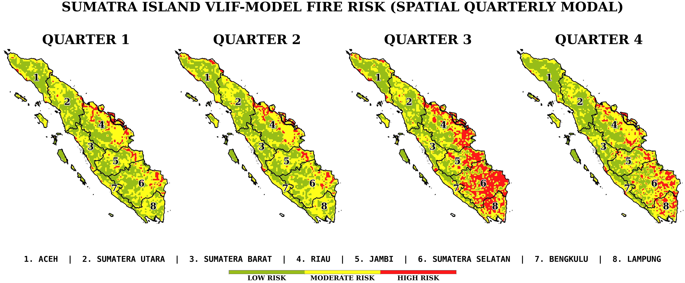

# Spatio-Temporal Forest and Land Fire Risk Modeling in Sumatra

Official implementation of the **VLIF-Model** (Vapor Pressure Deficit - Land Vulnerability Integrated Fuzzy Model), as presented in the research: *"Spatio-Temporal Forest and Land Fire Risk Modeling in Sumatra Using Atmospheric-Edaphic Integration via Bivariate Fuzzy C-Means"*.

## 📌 Overview
The VLIF-Model integrates atmospheric water demand (VPD) and edaphic (soil) vulnerability (LVI) to map vegetation fire risks. This model objectively zones fire risks using **Bivariate Fuzzy C-Means (FCM)**. 

This repository contains the analytical scripts and a representative dataset (50,000 samples) covering the **2023–2024** El Niño period in Sumatra, enabling full reproducibility of the clustering and geospatial visualization processes.

## 🚀 Performance Metrics (Revisi 2026 Validation)
Based on the spatial model validation using ground truth VIIRS thermal anomalies (hotspots):

| Metric | Value | Interpretation |
| :--- | :--- | :--- |
| **ROC-AUC** | **0.8288** | Excellent predictive power in distinguishing fire occurrence. |
| **FPC** (Fuzzy Partition Coefficient) | **0.6137** | High structural stability for K=3 clustering. |
| **Brier Score** | **0.0956** | High accuracy of the probabilistic risk forecast. |

### 📊 Cluster Distribution & Effectiveness
The model demonstrates exceptional spatial efficiency, specifically in the **High-Risk** zone:

| Risk Class | % Area | % Hotspot Captured | % Total FRP (Energy) |
| :--- | :--- | :--- | :--- |
| **LOW** | 41.31% | 5.56% | 3.85% |
| **MODERATE** | 41.41% | 12.91% | 10.00% |
| **HIGH** | **17.28%** | **81.54%** | **86.14%** |

> **Key Finding:** The **High-Risk** cluster covers only **~17%** of the total study area but successfully identifies over **81%** of fire hotspots and **86%** of the total Fire Radiative Power (FRP).

## 📂 Data Acquisition & Sources
This study utilizes an integrated dataset of 2,614,056 spatial observations. Key data sources include:
1. **Hotspots (Ground Truth):** S-NPP VIIRS (375m) from NASA FIRMS portal.
2. **Meteorology & Soil:** ECMWF ERA5-Land (Temperature, RH, Soil Moisture).
3. **Land Cover:** MODIS MCD12Q1 (v6.1) global classification at 500m resolution.
4. **Peatland:** Global Forest Watch (GFW) Indonesian peatland map.
5. **Anthropogenic Markers:** OpenStreetMap (OSM) extracts via Geofabrik (Roads & Settlements).
6. **Administrative Boundaries:** GeoJSON boundaries based on Indonesian Ministry of Home Affairs Decree (2025).

## 🛠️ Data Pipeline & Integration (Optional)
You can replicate the dataset construction from scratch using the provided pipeline.

* **Pipeline Script**: `vlif_dataset_integration.py`
* **Large File Download**: Due to GitHub size limits, the **Human_Activity_Index.zip** must be downloaded from:
  > [🔗 Download Human_Activity_Index.zip](https://bit.ly/HumanActivityZipFile)

> [!IMPORTANT]
> **Technical Note on Dataset Population:**
> The provided `VLIF_50000_SAMPLES.csv` is a statistically preserved sample derived from the original research population of **2,614,056 observations**. 
> This represents a complete 2-year spatio-temporal grid (2023–2024) covering Sumatra at **0.1° resolution**. Normalization in the official sample is based on this global population.

## 📁 Repository Structure
* `vlif_dataset_integration.py`: Script to fuse multi-source raw data.
* `main.py`: Core logic for Bivariate FCM clustering and validation.
* `visualization.py`: Script for spatial modal aggregation and risk map rendering.
* `VLIF_50000_SAMPLES.csv`: Official representative dataset (Sampled from 2.6M records).
* `provinsisumatera.geojson`: Sumatra provincial boundaries.

  ## 🗺️ Visualization Result (Quarter 1-4)

*Figure: Spatio-temporal distribution of forest fire risk in Sumatra (Quarter 1-4) using the VLIF-Model.*

## ⚙️ Execution Guide (Google Colab / Local)

### Option 1: Quick Start (Using Ready-to-Use Dataset)
1. **Prepare Files:** Download all files from this repository.
2. **Upload to Colab:** Upload `VLIF_50000_SAMPLES.csv` and `provinsisumatera.geojson` to your Colab session.
3. **Run Clustering:** Execute `main.py` to generate risk clusters and statistical metrics.
4. **Run Visualization:** Execute `visualization.py` to generate the 4-panel fire risk map.

### Option 2: Full Integration Pipeline (Build Dataset)
1. **Prepare Files:** Download raw components (`ERA5-Land`, `HAI.zip`, `Peat_Lands.zip`, `MODIS.tif`).
2. **Upload to Colab:** Upload all raw files + `provinsisumatera.geojson` to your Colab session.
3. **Run Integration:** Execute `vlif_dataset_integration.py`.
4. **Wait for Output:** A new `VLIF_50000_SAMPLES.csv` will be generated in your session.
5. **Proceed to Model:** Run `main.py` followed by `visualization.py` for results.

```bash
# Example command sequence
pip install pandas geopandas rasterio scikit-fuzzy scipy
python main.py
python visualization.py
